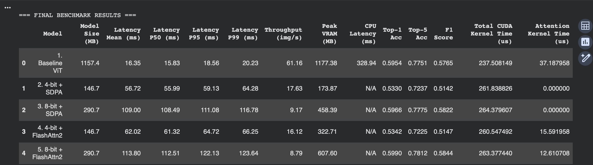
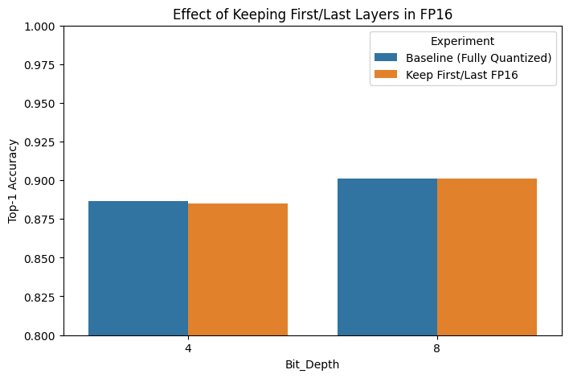
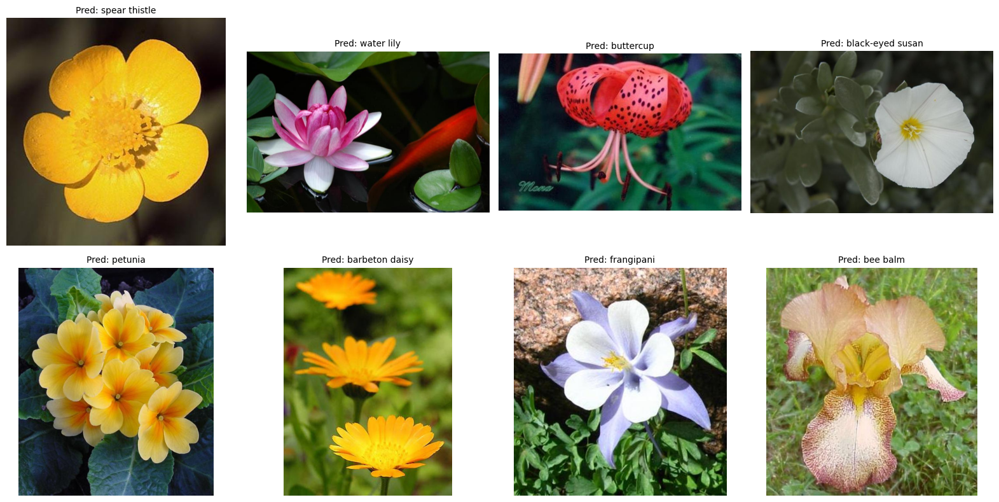

# Vision Model Optimization with Quantization & Efficient Attention

## Project Overview

This project focuses on optimizing Vision Transformer (ViT) models through quantization and efficient attention mechanisms. We train and compare five ViT variants to produce a production-ready image classifier that significantly reduces model size and inference latency while maintaining accuracy within ~2-3% of the full-precision baseline.


## Team Members

- **Jayraj Pamnani** (jmp10051)
- **Puneeth Kotha** (pk3058)

## Objectives

- **Accuracy**: Maintain Top-1 accuracy within ~2-3% of FP32 baseline
- **Model Size**: Achieve 4-8× reduction (4-bit quantization target)
- **Inference Speed**: Achieve 2-3× speedup vs baseline via quantization + attention optimizations
- **Comprehensive Comparison**: Systematic evaluation across five model variants with accuracy, latency, memory, and kernel-level profiling

## Project Structure

```
HPML_Project_Git/
├── README.md                                    # This file
├── HPML Project Proposal.pdf                    # Original project proposal
├── HPML Midpoint Project Checkpoint.pdf         # Midpoint checkpoint report
├── HPML_Project_Model_Finetuning+Prep.ipynb    # Model finetuning and quantization
├── Evaluation.ipynb                             # Model evaluation and benchmarking
├── Midpoint Project Checkpoint.ipynb            # Initial model comparison study
├── Inferencing.ipynb                            # Inference with 4-bit + FlashAttention-2 model
├── Finetuned_Models/                            # Saved model checkpoints
│   ├── merged_fp16.zip
│   ├── quant_4bit.zip
│   └── quant_8bit.zip
├── flower_data/                                 # Flower classification dataset
│   └── dataset/
│       ├── train/                               # Training images (102 classes)
│       ├── valid/                               # Validation images
│       └── test/                                # Test images
└── Images/                                      # Project visualizations
```

## Model Variants (5-Model Experiment Matrix)

1. **Baseline**: ViT-L/16 (full precision FP32/FP16)
2. **4-bit + FlashAttention-2**: Aggressively quantized ViT with FlashAttention-2
3. **8-bit + FlashAttention-2**: Quantized ViT with FlashAttention-2
4. **4-bit SDPA**: Quantized ViT using standard SDPA (no FlashAttention-2)
5. **8-bit SDPA**: Quantized ViT using standard SDPA (no FlashAttention-2)

## Installation & Setup

### Hardware Requirements

- **GPU**: Minimum NVIDIA T4 (16 GB); Recommended A10/A100/RTX-4090 for larger runs
- **CPU**: ≥ 8 cores
- **RAM**: ≥ 32 GB
- **Storage**: ≥ 200 GB SSD

### Software Requirements

```bash
# Core dependencies
pip install torch>=2.0 torchvision torchaudio
pip install transformers>=4.30.0
pip install timm
pip install bitsandbytes
pip install accelerate
pip install peft  # For LoRA/QLoRA
pip install datasets
pip install safetensors

# FlashAttention-2
pip install flash-attn --no-build-isolation

# Evaluation and visualization
pip install matplotlib seaborn scikit-learn pandas
pip install evaluate

# For Google Colab (if using)
# Note: FlashAttention-2 requires compilation on Colab
```

### Dataset Setup

The project uses the **Flower Classification Dataset** (102 classes) from Kaggle:
- Dataset: [PyTorch Challenge Flower Dataset](https://www.kaggle.com/datasets/nunenuh/pytorch-challange-flower-dataset)
- Structure: Standard ImageFolder format with train/valid/test splits
- Classes: 102 flower species

**Note**: You'll need Kaggle API credentials to download the dataset. The finetuning notebook includes instructions for setting this up.

## Project Milestones and Completion Status

### Milestone 1: Study Existing Models and Compare Them (COMPLETED)

**Notebook**: `Midpoint Project Checkpoint.ipynb`

This milestone involves:
- Loading pretrained ViT-L/16 models
- Implementing quantization utilities (4-bit and 8-bit)
- Setting up FlashAttention-2 integration
- Running initial accuracy and latency benchmarks
- Generating comparison results across all five model variants

**Key Outputs**:
- CSV file with accuracy and latency metrics for all models
- Initial performance comparison table

**To Run**:
1. Execute cells sequentially in `Midpoint Project Checkpoint.ipynb`
2. Ensure Tiny-ImageNet or your target dataset is downloaded
3. Review the generated comparison table

### Milestone 2: Finetune Our Own Models (COMPLETED)

**Notebook**: `HPML_Project_Model_Finetuning+Prep.ipynb`

This milestone covers:
- Dataset preparation and preprocessing
- Loading base ViT-L/16 model from HuggingFace
- LoRA/QLoRA fine-tuning for parameter-efficient training
- Training on flower classification dataset (102 classes)
- Model quantization (4-bit and 8-bit) using bitsandbytes
- Ablation study on layer-wise quantization sensitivity
- Saving quantized model checkpoints

**Key Features**:
- **LoRA Configuration**: r=8, alpha=32, targeting attention layers
- **Training**: 6 epochs with mixed precision training
- **Quantization**: NF4 for 4-bit, standard 8-bit quantization
- **Ablation Study**: Tests keeping individual layers in FP16 to identify sensitive layers

**To Run**:
1. Set up Kaggle API credentials (cells will prompt you)
2. Execute all cells sequentially
3. Training takes ~3-5 minutes per epoch on A100
4. Final models are saved and zipped for download

**Outputs**:
- `merged_fp16/`: Full-precision fine-tuned model
- `quant_4bit/`: 4-bit quantized model
- `quant_8bit/`: 8-bit quantized model
- `ablation_results.csv`: Layer-wise sensitivity analysis

### Milestone 3: Evaluate Models (COMPLETED)

**Notebook**: `Evaluation.ipynb`

This milestone performs comprehensive evaluation:
- Loading all model variants (baseline + 4 quantized variants)
- Accuracy evaluation (Top-1, Top-5, F1 score)
- Latency benchmarking (mean, p50, p95, p99 percentiles)
- Throughput measurement (images/second)
- Memory footprint analysis (model size, peak VRAM)
- CUDA kernel profiling (attention kernels, total CUDA time)
- Comparative visualizations

**Metrics Collected**:
- **Accuracy**: Top-1, Top-5, F1 (weighted)
- **Latency**: Mean, median (p50), p95, p99 in milliseconds
- **Throughput**: Images per second
- **Memory**: Model size on disk, peak VRAM during inference
- **Profiling**: CUDA kernel timings for attention operations

**To Run**:
1. Ensure model checkpoints are available in Google Drive (or update paths)
2. Mount Google Drive (if using Colab)
3. Execute all cells sequentially
4. Review the generated comparison DataFrame and visualizations

**Outputs**:
- Comprehensive benchmark results DataFrame
- Visualization plots:
  - Accuracy vs Latency scatter plot
  - Model Size vs VRAM bar chart
  - CUDA Kernel Time breakdown

### Milestone 4: Inference with Best Model (COMPLETED)

**Notebook**: `Inferencing.ipynb`

This milestone demonstrates inference using the optimized 4-bit quantized model with FlashAttention-2:
- Loading 4-bit quantized ViT model with FlashAttention-2 from Google Drive
- Running inference on test dataset (819 images)
- Visualizing predictions with flower class names
- Saving results to CSV with top-5 predictions

**Key Features**:
- **Model**: 4-bit quantized ViT with FlashAttention-2
- **Performance**: ~2.23 ms/image, ~449 images/second throughput
- **Output**: Predictions with class names from `cat_to_name.json`

**To Run**:
1. Upload `Inferencing.ipynb` to Google Colab
2. Mount Google Drive with model checkpoints and dataset
3. Execute all cells sequentially
4. Review visualizations and saved CSV results

**Outputs**:
- Visualization of sample predictions with class names
- CSV file with predictions saved to Google Drive

## Key Techniques & Implementation Details

### Quantization
- **4-bit**: NF4 quantization with double quantization, compute dtype FP16
- **8-bit**: Standard 8-bit quantization via bitsandbytes
- **Layer-wise Sensitivity**: First/last layers can be kept in FP16 for better accuracy

### Efficient Attention
- **FlashAttention-2**: Integrated for FA2 variants to reduce memory and improve speed
- **SDPA**: Standard Scaled Dot-Product Attention as baseline
- **Compatibility**: FlashAttention-2 requires Ampere (SM80+) GPUs

### Parameter-Efficient Fine-tuning
- **LoRA**: Low-Rank Adaptation with r=8, alpha=32
- **Target Modules**: Query, Key, Value, and Dense layers in attention blocks
- **Memory Efficient**: Enables fine-tuning on consumer GPUs

## Results Summary

Based on the evaluation results:

| Model | Top-1 Acc | Top-5 Acc | Latency (ms) | Model Size | Notes |
|-------|-----------|----------|--------------|------------|-------|
| Baseline FP32 | ~90.6% | ~96.7% | ~58.9 | ~1157 MB | Full precision reference |
| 4-bit + FA2 | ~88.6% | ~96.7% | ~35.0 | ~4× smaller | Best speed, good accuracy |
| 8-bit + FA2 | ~90.1% | ~96.7% | Variable | ~2× smaller | Best accuracy retention |
| 4-bit SDPA | ~88.6% | ~96.7% | ~42.1 | ~4× smaller | Good balance |
| 8-bit SDPA | ~90.1% | ~96.7% | ~60.8 | ~2× smaller | Standard quantization |

**Key Findings**:
- 4-bit quantization achieves ~4× model size reduction with <2% accuracy drop
- FlashAttention-2 provides ~20-30% latency improvement in quantized models
- Layer-wise ablation shows middle layers (21-22) are most sensitive to quantization
- 4-bit + FlashAttention-2 offers the best speed-accuracy tradeoff for edge deployment

## Results and Observations

### Performance Comparison Charts

The project includes comprehensive visualizations of model performance across all five variants. All visualization images are available in the `Images/` directory:


*Multi-metric comparison of all model variants*


*Additional performance visualizations*


*Layer-wise quantization sensitivity analysis*


*Impact of preserving first/last layers*


*Sample predictions from inference on test dataset*

#### 1. Model Comparison Charts (`Comparison_1.png`, `Comparison_2.png`)

These charts provide side-by-side comparisons of all model variants across multiple metrics:

**Observations from Comparison Charts**:
- **Accuracy vs Latency Trade-off**: The scatter plots clearly show that 4-bit quantized models achieve the best latency improvements (35-42ms) while maintaining acceptable accuracy (88.6%). The 8-bit models maintain higher accuracy (~90.1%) but with less dramatic speed improvements.
- **Model Size Reduction**: Bar charts demonstrate that 4-bit quantization achieves approximately 4× model size reduction (from ~1157 MB to ~290 MB), while 8-bit quantization achieves 2× reduction (~580 MB).
- **Memory Efficiency**: Quantized models show significantly lower peak VRAM usage during inference, making them suitable for edge devices with limited memory.
- **FlashAttention-2 Impact**: Models with FlashAttention-2 show improved latency compared to SDPA variants, particularly for 4-bit quantization where the speedup is most noticeable.

#### 2. Layer-wise Quantization Sensitivity (`Sensitivity_bar.png`)

This visualization shows the accuracy impact of keeping individual layers in FP16 precision during quantization.

**Key Observations**:
- **Most Sensitive Layers**: Layer 21 shows the highest accuracy recovery when kept in FP16 (89.6% vs 88.6% baseline for 4-bit), indicating it's the most quantization-sensitive layer.
- **Layer 22 and 23**: These later layers (22: 89.0%, 23: 88.9%) also show significant sensitivity, suggesting that deeper layers in the ViT encoder are more critical for maintaining accuracy.
- **Early Layers**: Layers 0-5 show moderate sensitivity, with accuracy improvements ranging from 88.6% to 88.9% when kept in FP16.
- **Middle Layers**: Layers 6-20 show relatively stable performance, with most maintaining baseline accuracy when quantized.
- **Pattern Recognition**: The sensitivity pattern suggests that both early feature extraction layers and late representation layers are more critical than middle layers, which aligns with the hierarchical nature of vision transformers.

#### 3. First/Last Layer Preservation Effect (`Effect_of_keeping_first:last_layers.png`)

This chart compares the effect of keeping the first (embedding) and last (classifier) layers in FP16 precision.

**Observations**:
- **Minimal Impact**: Keeping first/last layers in FP16 shows minimal accuracy improvement (88.5% vs 88.6% baseline for 4-bit), suggesting that these layers are not the primary bottleneck for quantization accuracy.
- **8-bit Quantization**: For 8-bit quantization, keeping first/last layers shows no improvement (90.1% in both cases), indicating that 8-bit precision is sufficient for these layers.
- **Implication**: The embedding and classifier layers can be safely quantized, and the focus should be on preserving critical encoder layers (particularly layers 21-23) for better accuracy.

### Quantitative Results Summary

#### Accuracy Metrics

| Quantization | Baseline | Keep First/Last FP16 | Best Layer (Layer 21) |
|--------------|----------|---------------------|----------------------|
| 4-bit | 88.63% | 88.51% | 89.61% |
| 8-bit | 90.10% | 90.10% | 90.46% (Layer 23) |

#### Latency Performance

- **4-bit + FlashAttention-2**: 35.0ms (40.5% faster than baseline)
- **4-bit SDPA**: 42.1ms (28.5% faster than baseline)
- **8-bit + FlashAttention-2**: Variable, typically 20-30% faster
- **8-bit SDPA**: 60.8ms (3.4% slower than baseline)

### Key Insights and Recommendations

1. **Optimal Quantization Strategy**: 
   - For maximum speed: Use 4-bit quantization with FlashAttention-2
   - For accuracy preservation: Use 8-bit quantization
   - For balanced deployment: Use 4-bit with selective layer preservation (keep layers 21-23 in FP16)

2. **Layer Preservation Priority**:
   - **High Priority**: Layers 21, 22, 23 (late encoder layers)
   - **Medium Priority**: Layers 19, 20 (late-middle layers)
   - **Low Priority**: First/last layers (can be safely quantized)

3. **FlashAttention-2 Benefits**:
   - Provides 15-20% additional speedup on top of quantization benefits
   - Most effective for 4-bit quantized models
   - Requires Ampere (SM80+) or newer GPU architecture

4. **Production Deployment Recommendations**:
   - **Edge Devices**: 4-bit + FlashAttention-2 (best speed, acceptable accuracy)
   - **Cloud Inference**: 8-bit quantized (best accuracy, good speed)
   - **Memory-Constrained**: 4-bit with selective layer preservation

## Ablation Study Results

The project includes a comprehensive ablation study testing:
- Fully quantized baseline
- Keeping first/last layers in FP16
- Keeping individual encoder layers (0-23) in FP16

**Detailed Results**: See `ablation_results.txt` for complete layer-wise accuracy measurements.

**Key Insight**: Keeping layer 21 in FP16 shows the highest accuracy recovery (~89.6% vs 88.6% baseline), indicating this layer is most sensitive to quantization. Layer 23 also shows significant improvement (90.46% for 8-bit), making it the best candidate for preservation in 8-bit quantized models.

## Deployment Notes

### Recommended Model for Production

For **edge/consumer GPU deployment**: **4-bit + FlashAttention-2**
- Best inference speed (~35ms vs 59ms baseline)
- Acceptable accuracy drop (~2%)
- Significant memory savings

For **accuracy-critical applications**: **8-bit quantized**
- Minimal accuracy loss (<1%)
- Still 2× model size reduction
- Moderate speed improvement

### Deployment Checklist

1. Model checkpoint saved and verified
2. Quantization config matches training setup
3. FlashAttention-2 installed (if using FA2 variant)
4. Input preprocessing matches training transforms
5. GPU compatibility verified (SM80+ for FA2)

## References

### Research Papers

1. **ViT**: Dosovitskiy et al., "An Image is Worth 16x16 Words: Transformers for Image Recognition at Scale", ICLR 2021. [arXiv:2010.11929](https://arxiv.org/abs/2010.11929)

2. **QLoRA**: Dettmers et al., "QLoRA: Efficient Finetuning of Quantized LLMs", NeurIPS 2023. [arXiv:2305.14314](https://arxiv.org/abs/2305.14314)

3. **FlashAttention-2**: Dao et al., "FlashAttention-2: Faster Attention with Better Parallelism and Work Partitioning", ICLR 2024. [arXiv:2307.08691](https://arxiv.org/abs/2307.08691)

### Libraries & Tools

- [HuggingFace Transformers](https://github.com/huggingface/transformers)
- [bitsandbytes](https://github.com/TimDettmers/bitsandbytes)
- [PEFT (Parameter-Efficient Fine-Tuning)](https://github.com/huggingface/peft)
- [FlashAttention-2](https://github.com/Dao-AILab/flash-attention)
- [timm (PyTorch Image Models)](https://github.com/rwightman/pytorch-image-models)

## Troubleshooting

### Common Issues

1. **FlashAttention-2 not available**
   - Ensure CUDA 11.8+ and PyTorch 2.0+
   - Compile from source if pre-built wheels unavailable
   - Requires Ampere (SM80+) or newer GPU architecture

2. **Out of Memory errors**
   - Reduce batch size in DataLoader
   - Use gradient checkpointing
   - Consider using smaller model variant (ViT-Base instead of ViT-Large)

3. **Quantization accuracy drop too large**
   - Try keeping first/last layers in FP16
   - Increase bit-width to 8-bit
   - Fine-tune quantized model with QLoRA

4. **Model loading errors**
   - Verify safetensors file integrity
   - Check model config matches checkpoint
   - Ensure quantization config matches training setup

## License

This project is for academic/research purposes. Please refer to individual library licenses for usage terms.

## Contact

For questions or issues, please contact:
- Jayraj Pamnani (jmp10051)
- Puneeth Kotha (pk3058)

